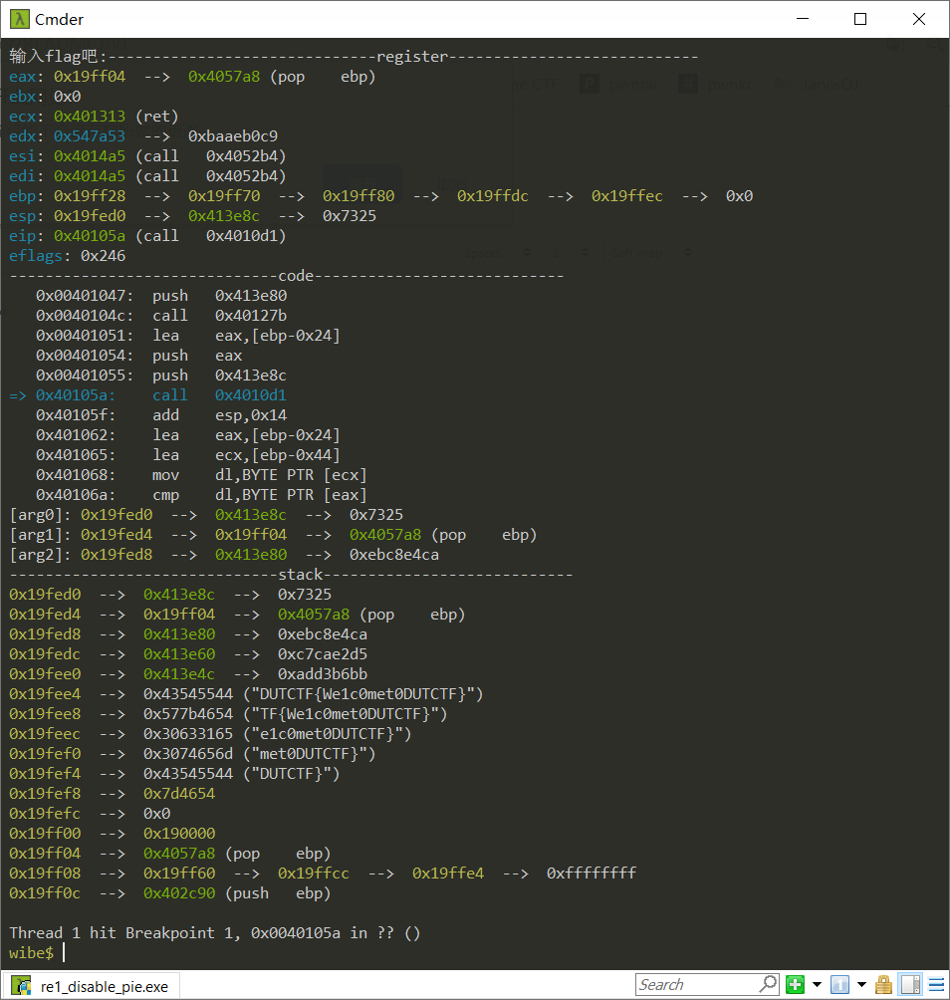

## wibe: peda-like gdb-script that support mingw-gdb on windows

### deps
1. mingw gdb
+ please install the mingw-gdb ref by the link bellow, because wibe just support python2 yet 
https://sourceforge.net/projects/mingw-w64/files/External%20binary%20packages%20%28Win64%20hosted%29/gdb/

## install
1. git clone https://github.com/Byzero512/wibe
2. add the absolute path of init.py into ~/.gdbinit

## command
1. vmmap, maps
    + for vmmap command, you need https://github.com/Byzero512/vmmap-win-cmd
2. xinfo address
3. pcon, pstack, preg
4. nb ins_address_offset_to_program_base
3. sp, bp

## photos

